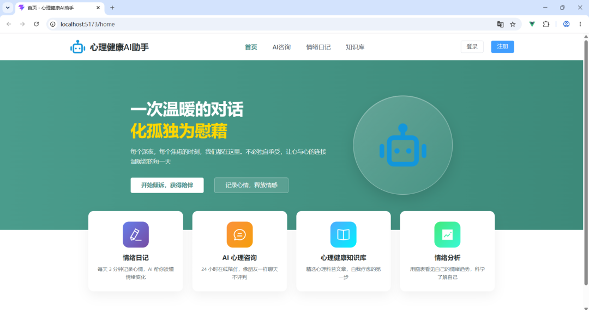
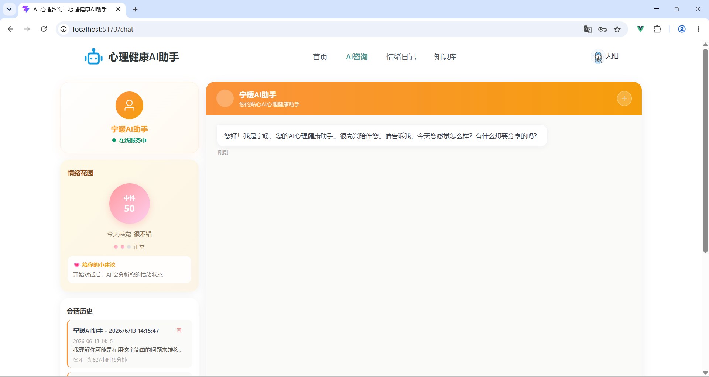
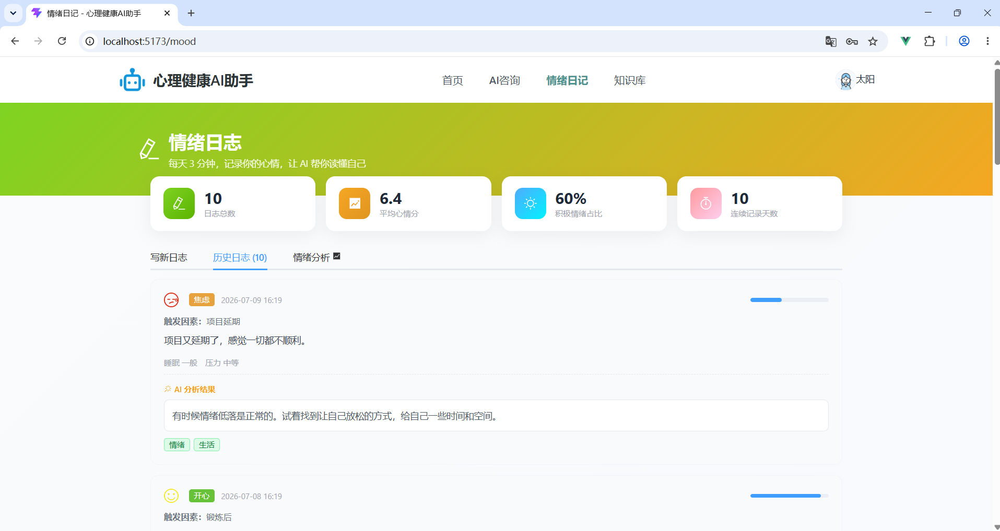
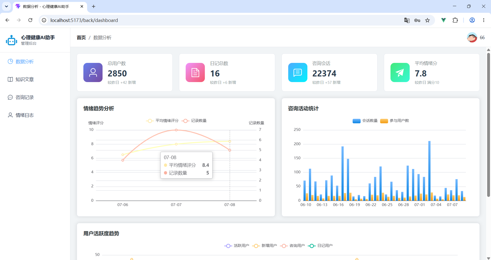

# 心理健康 AI 助手 - 前端

基于 Vue 3 + Vite + Element Plus 构建的心理健康服务平台，包含用户端 AI 心理咨询、情绪日记、知识库，以及管理端数据可视化看板。

## 技术栈
- **框架**：Vue 3 + Vite
- **UI**：Element Plus + Sass
- **图表**：ECharts
- **状态管理**：Pinia
- **路由**：Vue Router
- **SSE 流式**：@microsoft/fetch-event-source

## 项目结构
- `src/views/` — 页面（用户端 + 管理端）
- `src/components/` — 布局组件（FrontendLayout / BackendLayout）
- `src/api/` — 后端接口封装
- `src/stores/` — Pinia 状态
- `src/router/` — 路由配置
- `src/utils/request.js` — Axios 封装

## 功能模块
- **AI 心理咨询**：流式对话、情绪花园实时分析、快捷回复、会话历史
- **情绪日记**：评分+情绪选择、触发因素记录、睡眠质量/压力评估、AI 关键词/建议/风险分析
- **知识库**：分类筛选、文章搜索、热门排行
- **管理端**：ECharts 多图表数据看板、情绪日志管理、知识文章/咨询记录管理

## 快速开始
```bash
npm install
npm run dev
```

## 项目截图

| 首页 | AI 心理咨询 |
|:---:|:---:|
|  |  |

| 情绪日记 | 管理端看板 |
|:---:|:---:|
|  |  |

---
